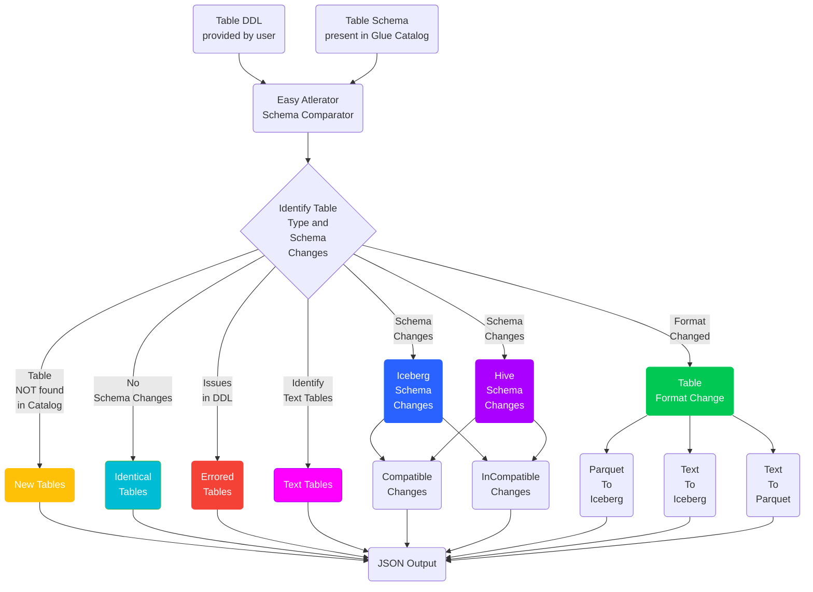

# EASY ALTERATOR
- This utility is developed to identify the schema changes for:
   - `EXTERNAL` HIVE `PARQUET` tables data pipelines that uses AWS Glue Catalog as hive metastore for spark jobs.
   - For ICEBERG tables that uses AWS Glue Catalog as Iceberg Catalog.
- Identification of table format changes:
    - `PARQUET` to `ICEBERG`
    - `TEXT` to `PARQUET`
    - `TEXT` to `ICEBERG`
- Data Type Change identification:
    - Compatible Data Type Changes
    - Incompatible Data Type changes
- This utility compares the hql/DDL provided for the table with the schema present in `AWS Glue Catalog`, identifies the newly added/removed columns along with data type update for any column if there is any, and updates the table schema in AWS Glue Catalog automatically for **HIVE** tables.
- Incase of **data type mismatch** with the already existing tables, data type compatibility is checked, if data type change is compatible with the query engine being used for data, table will be updated and if not then update is skipped

## Internal Working of Easy Alterator



## DDL Checks before updating a table
There are some checks implemented in place that checks if the table being updated safely and won't break any query engine which is used to query the data after the udate. Below are the mentioned checks that are in place:
1. DDL Statement is a `CREATE` table statement.
2. Table is an `EXTERNAL` table at both the places i.e. in provided DDL file and in glue catalog.
3. Table is a `PARQUET` table as per the provided DDL and in glue catalog.
4. `Partition Columns` are not changed.
5. `data type` compatibility in case of data type of table is changed.

### Athena Query Engine
 Original Datatype | Available Target Datatype |
| --- | ----------- |
|STRING|BYTE, TINYINT, SMALLINT, INT, BIGINT
|BYTE|	TINYINT, SMALLINT, INT, BIGINT
|TINYINT|	SMALLINT, INT, BIGINT
|SMALLINT|	INT, BIGINT
|INT|	BIGINT
|FLOAT|	DOUBLE

### Iceberg Compatible Data Type
Iceberg only supports data type widening. More details on ICEBERG Schema Evolution: [Iceberg Documentation](https://iceberg.apache.org/docs/latest/spark-ddl/#alter-table-alter-column)

## JSON Response from EA

### Response Metadata
```json
{
  "ResponseMetadata": {
    "validation": true,
    "force": false,
    "stats": {
      "num_tables_analyzed": 458,
      "num_updates": 1,
      "num_skipped": 0,
      "num_new": 11,
      "num_errored": 0,
      "num_identical": 35,
      "num_non_parquet_tables": 39,
      "num_iceberg_tables": 187,
      "num_format_changed_tables": 185
    }
  }
}
```

### Hive Table Changes

#### Compatible Changes
Compatible Changes for Hive Format Tables are marked under `success_tables`
```json
"success_tables": [
    {
        "table_name": "sdb.raw_sales",
        "previous_version": "3",
        "current_version": "3",
        "details": {
            "add": [
                {
                    "Name": "ile1",
                    "Type": "string"
                },
                {
                    "Name": "sovereign_guarantee_flag",
                    "Type": "string"
                }],
            "delete": [
                {
                    "Name": "rbs_trading_counterparty",
                    "Type": "string"
                }]
        }
    },
...
]
```

#### Incompatible Changes
Whenever there are Incompatible data type changes for Hive Format Tables, these are marked under `skipped_tables` along with compatible data type changes
```json
"skipped_tables": [
    {
        "table_name": "sdb.quaterly_sales",
        "reason": "IncompatibleDataTypeError",
        "details": {
            "compatible": [],
            "incompatible": [
                {
                    "Name": "original_effective_maturity",
                    "Type": "bigint",
                    "updated_type": "double"
                }
            ],
            "add": [
                {
                    "Name": "ile1",
                    "Type": "string"
                }
            ],
            "delete": [
                {
                    "Name": "rbs_trading_counterparty",
                    "Type": "string"
                }
            ]
        }
    },
    ...
    ]
```


#### Partition Column Changes
Partition Column changes are marked under `skipped_tables` as these will require backfill along with validation errors:
- `PartitionValidationError`: Changes in partitioning of hive tables. This includes:
    - Data type changes in partition columns
    - New column added in partition columns
    - Column removed in paritition columns
- `PartitionOrderValidationError`: Order of existing partition columns is changed
- `IncompatibleDataTypeAndPartitionValidationError`: Partition Column Changes along with Incompatible Data Type Changes for the same table.

```json
{
    "skipped_tables": [
        {
            "table_name": "srtd_detail.feed_ge_exp_d_a_b3_hive_ft1_st",
            "reason": "PartitionOrderValidationError"
        },
        ...
    ]
}
```

### Iceberg Schema Changes
All Iceberg Schema table changes are marked under `iceberg_tables`. Iceberg Schema changes include N main sections:
- `new`: New columns added in table
- `dropped`: Columns dropped from table
- `renamed`: Columns renamed in table
- `updated`: Columns with data type changes
    - `compatible`: Columns with compatible data type changes
    - `incompatible`: Columns with Incompatible data type changes
    - `position_changes`: Columns with position changes
        - `direct`: Main column position changes
        - `cascade`: Position changes resulted from main position change
- `partition_columns`
    - `new`: newly added partition columns
    - `dropped`: removed partition columns
    - `replaced`: partition column is replaced by any other columns
- `tblprops`
    - `new`: newly added table properties

Response structure is:

```json
"iceberg_tables": [
        {
            "table_name": "catalog.db.table_name",
            "columns": {
                "new": [
                    {
                        "name": "col1",
                        "type": "string"
                    },
                    {
                        "name": "col2",
                        "type": "string"
                    }
                ],
                "dropped": [
                    "col3",
                    "col4"
                ],
                "renamed": [
                    {
                        "old_name": "col5",
                        "new_name": "col5_new"

                    }
                ],
                "updated": {
                    "compatible": [
                        {
                            "name": "col6",
                            "old_type": "int",
                            "new_type": "long"
                        }
                    ],
                    "incompatible": [
                        {
                            "name": "col7",
                            "old_type": "double",
                            "new_type": "long",
                            "backfilled_from": "col7_hist"
                        }
                    ],
                    "position_changes": [
                        {
                            "name": "col0",
                            "after": "col8",
                            "reason": "direct"
                        },
                        {
                            "name": "col8",
                            "after": "col9",
                            "reason": "cascade"
                        },
                        {
                            "name": "col9",
                            "after": "col10",
                            "reason": "cascade"
                        }
                    ]
                }
            },
            "partition_columns": {
                "new": [
                    {
                        "field_id": 1002,
                        "name": "col2"
                    }
                ],
                "dropped": [
                    "pcol1"
                ],
                "replaced": [
                    {
                    "old_name": "col3",
                    "new_name": "col4"
                    }
                ],
            },
            "tblprops": {
                "new": {
                    "write.delete.mode": "merge-on-read",
                    "write.merge.mode": "merge-on-read",
                    "write.update.mode": "merge-on-read"
                }
            }
        },
        ....
]
```

### Identical Tables
```json
"identical_tables": [
        "srtd_control.dim_process_control_ft1_st",
        "srtd_detail.feed_ge_exp_m_u_b31_ft1_st"
        ]
```

### Errored Tables
```json
"errored_tables": [
    {
        "table_name": "",
        "filename": "/home/hadoop/rtd/Baselrwa/resoruces/hql/CREATE_TABLE_NAME.hql",
        "reason": "TableNameNotExtracted",
    }
]
```

### Non Parquet Tables/TEXT Tables
```json
"non_parquet_tables": [
        "srtd_ref.gohbrdgehstry",
        "srtd_ref.dim_rule_eligibility_ft1_st",
        "srtd_ref.securtsatnref1"
]
```

### Format Changed Tables
```json
"format_changed_tables": [
        {
            "old_format": "PARQUET",
            "new_format": "ICEBERG",
            "table_name": "db.table"
        },
       {
            "old_format": "TEXT",
            "new_format": "ICEBERG",
            "table_name": "db.table1"
        },
        {
            "old_format": "TEXT",
            "new_format": "PARQUET",
            "table_name": "db.table1"
        },
    ]
```

----
# Usage

```bash
python3 easy_alterator.py --validate -p /home/hadoop/ddl/,/home/hadoop/hql/xyz.hql
```

## Pre-requisites
The only pre-requisite is to provide the DDL file and config yaml file in a specific format.

### Hive Table DDL Format
It's case-insensitive. It should follow the format of
1. keeping the `table name` and `column name` within ticks (`)
2. TABLE FORMAT can be mentioned using `STORED AS PARQUET` or combination of `ROW FORMAT SERDE`, `INPUTFORMAT` and `OUTPUTFORMAT`

```sql
CREATE EXTERNAL TABLE IF EXISTS `db_name.table_name`(
    `column1` string,
    `column2` double,
    `column3` bigint,
    ....
)
PARTITIONED BY (
    `column5` date,
    `column6` int,
    ....
)
STORED AS PARQUET
or
ROW FORMAT SERDE 'org.apache.hadoop.hive.ql.io.parquet.serde.ParquetHiveSerDe'
STORED AS INPUTFORMAT 'org.apache.hadoop.hive.ql.io.parquet.MapredParquetInputFormat'
OUTPUTFORMAT 'org.apache.hadoop.hive.ql.io.parquet.MapredParquetOutputFormat'
LOCATION "s3://<bucket>/<key>";
```

### Iceberg Table DDL Format
Defining ICEBERG tables must follow the rules in addition with the common rules:

1. Order agnostic now, i.e. Sequence of columns doesn't matter in DDL file.
2. `EXTERNAL` keyword must be **EXCLUDED**.
3. `USING iceberg` clause must be present **BEFORE** `PARTITIONED BY` clause.
4. Columns used in `PARTITIONED BY` clause must be defined within the columns and musn't include the data types.
5. ADD/RENAME/DROP Column Rules:
    - New columns ~~must be added in the **END** of columns section~~ can be added anywhere.
    - Column Renames must ~~be done **INPLACE**~~ mention `-- renamed_from: old_col_name` after the `col_name type,` in DDL.
    - Dropped columns must be marked with `--` in the start of column names.
6. DDL must have either ALL the columns defined in `lowercase` or `uppercase`. Mixed cases cause issue when running `DESC FORMATTED <tablename>` in Athena.
7. Table names are case-sensitive when being used with Glue Catalog so table name must be in all `lowercase`.
8. For adding columns in between us `--after: col_name`.
9. To backfill any column in ICEBERG Tables, below mentioned step needs to be followed:
    - Rename the column for which data type is changed and requires backfilling, for e.g. `col6` datatype changed from double to bigint, then rename `col6` double to `col6_hist` double.
    - Add a new column with update data type, i.e. `col6` bigint
    - For this newly added column, add `-- backfilled_from: col6_hist`
    - Refer the below mentioned example, how DDL will look like for `col6` data type changed from `double` to `bigint`

#### ICEBERG DDL EXAMPLE
```sql
CREATE TABLE IF NOT EXISTS `db.iceberg_table_ENV_PARAMS` (
    `col1` string,
    -- `col2` double,
    `col3` decimal(18, 7),
    `col5` bigint, -- renamed_from: col4
    `day_rk` date,
    `run_rk` int,
    `new_col` timestamp,
    `seq_col` string, -- after: col3
    `col6_hist` double,
    `col6` bigint, -- backfilled_from: col6_hist
)
USING iceberg
PARTITIONED BY (
    `day_rk`,
    `run_rk`
)
LOCATION 's3://bucket-{aws_account_id}-data/db_location/iceberg/table_name_ENV_PARAMS'
TBLPROPERTIES(
    'write.merge.mode'='merge-on-read',
	'write.delete.mode'='merge-on-read',
	'write.update.mode'='merge-on-read'
);
```


> **Note:** If Location in DDL has `aws_account_id` mentioned in path, you can mention it as `{aws_account_id}` which will be replaced by the actual aws account id automatically in case the code is running on EMR using the curl command:
``` python
TOKEN_CMD = 'curl -s -X PUT http://169.254.169.254/latest/api/token -H "X-aws-ec2-metadata-token-ttl-seconds: 21600"'
    token_result = sp.run(shlex.split(TOKEN_CMD), shell=False, capture_output=True, text=True)
    if token_result.returncode !=0:
        raise Exception("Error occured while getting token.")
    else:
        token = token_result.stdout.strip()
        METADATA_CMD = f"""curl -H "X-aws-ec2-metadata-token: {token}" -s http://169.254.169.254/latest/dynamic/instance-identity/document"""
        acct_result = sp.run(shlex.split(METADATA_CMD), shell=False, capture_output=True, text=True)
        instance_identity = json.loads(acct_result.stdout.strip())
        account_id = instance_identity.get('accountId')
        return account_id
```

### YAML CONFIG
YAML configuration file format:
1. if `--path` is defined with the path for the table DDLs,
```
path: <s3-path> or <local-fs like emr local>
tables:
    - table1
    - table2
    - table3
    - table4
```

## Parameters
| Parameters | Usage | Is Mandatory ? | Any Additional condition |
|----------|--------|------|-------|
|`-h or --help` | To get the details of all the parameters | No |
|`-p or --path`| To provide the paths to DDL files folder separated by `space` or Path to DDL files separated by `space`.|Yes if `-c` is not used.|
|`-c or --config`|DDL config yaml|Yes if `-p` is not used| In case of selective multiple tables needs to be updated, all such table names can be provided as a `YAML` config file.
|`-cp or --key_for_path`|Key in DDL config file for reading path to DDL folder.|Yes if `-c` is used and `-p` is not used| In case of `--config` is used, it is required to provide the path of the folder from where these table DDL's need to be read, this path can either be provided via `--path or -p` or a key in `YAML` config file. In later case that key needs to be provided as `-cp <key-name>`
|`-fs or --file_suffix`|Suffix for DDL files to be picked from path. Default is `hql`|No| For filtering type of DDL files based on prefix. Possible values: `hql`, `txt`
|`-fp or --file_prefix`|Prefix for DDL files to be picked from path.|No| For filtering type of DDL files based on suffix.
|`--validate`|To check how the actual run will impact the tables. Doesn't update anything in tables.|No|More like a dry run of all the changes and getting details of what all columns will be updated/removed/added as a part of actual run with the provided configuration.
